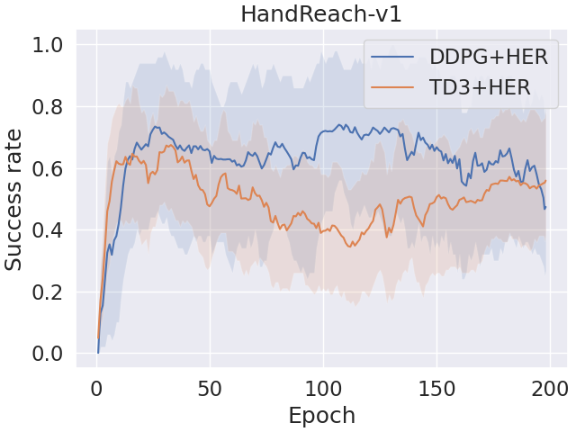
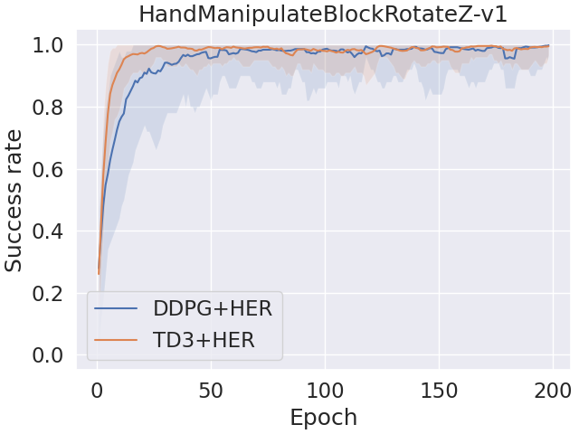
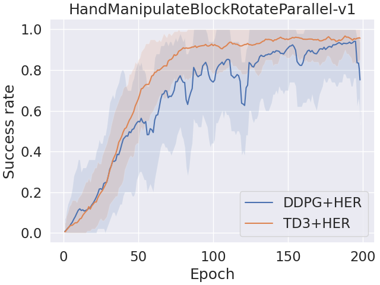
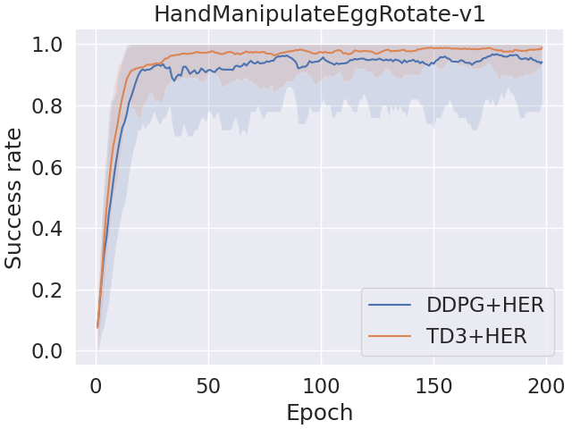
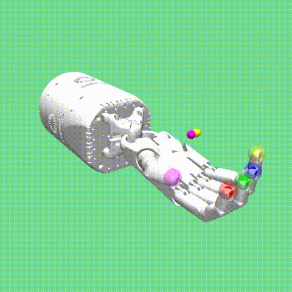

# TD3+HER vs DDPG+HER for Shadow Dexterous Hand Tasks

# Comparison of Results
|_|_|
|:---:|:---:|
| |
| |

# Demo

Reach| Block Rotate Z |
-----------------------|-----------------------|
| |

Block Rotate Parallel | Egg Rotate|
-----------------------|-----------------------|
|

# Reference
- TD3: https://arxiv.org/abs/1802.09477
  
- DDPG: https://proceedings.mlr.press/v32/silver14.pdf

- HER: https://arxiv.org/abs/1707.01495
  
- Open AI: https://doi.org/10.48550/arXiv.1707.01495
  
- Environment: https://robotics.farama.org/envs/shadow_dexterous_hand/
